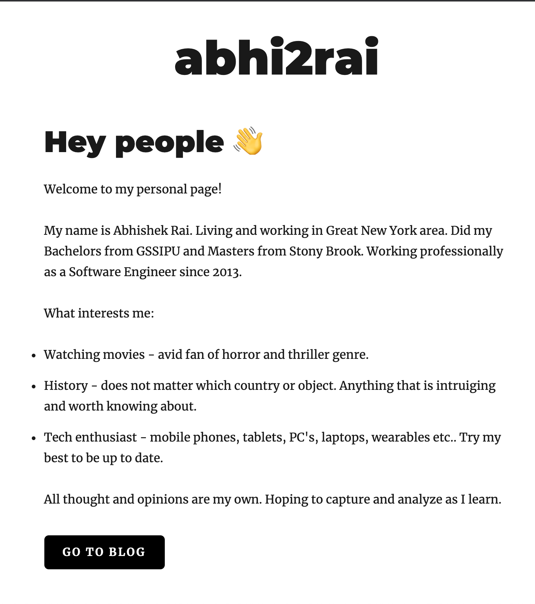

<!-- AUTO-GENERATED-CONTENT:START (STARTER) -->
<h1 align="center">
  Personal blog site using Gatsby - https://abhi2rai.com
</h1>

This is made using a variation of the the tutorial posted by developer Thomas Wang here:
https://www.thomas.wang/blog/developer-blog

Idea was to play around Gatsby and try to use a headlesss CMS like Netlify. This helped to scale the site and be able to add more content without deploying new code.

## 🎓 Learning Gatsby

Looking for more guidance? Full documentation for Gatsby lives [on the website](https://www.gatsbyjs.org/). Here are some places to start:

- **For most developers, we recommend starting with our [in-depth tutorial for creating a site with Gatsby](https://www.gatsbyjs.org/tutorial/).** It starts with zero assumptions about your level of ability and walks through every step of the process.

- **To dive straight into code samples, head [to our documentation](https://www.gatsbyjs.org/docs/).** In particular, check out the _Guides_, _API Reference_, and _Advanced Tutorials_ sections in the sidebar.

## 📔 Learning Netlify CMS with Gatsby

Start from [this point](https://www.gatsbyjs.org/docs/sourcing-from-netlify-cms/#authenticating-with-github) in the Gatsby documentation to finish the set up for your personal Netlify CMS with authentication.

## 💫 Deploy

<!-- AUTO-GENERATED-CONTENT:END -->
